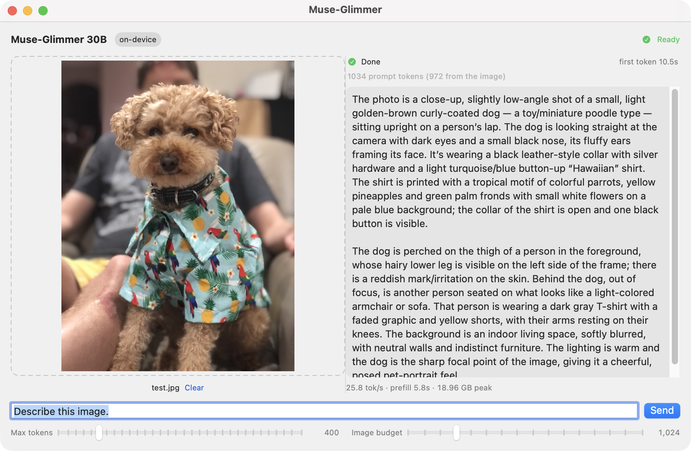
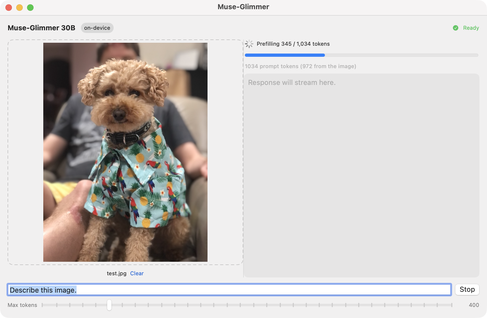
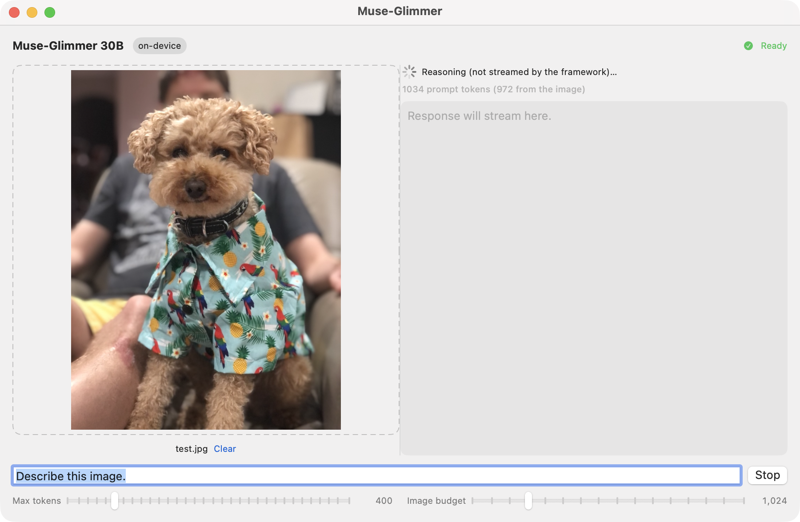
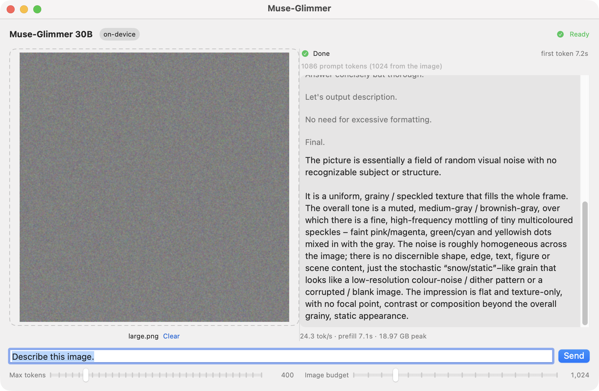

# Muse-Glimmer Demo

A SwiftUI macOS app that runs [`meta-models/Muse-Glimmer-30B`](https://huggingface.co/meta-models/Muse-Glimmer-30B)
entirely on-device: drop in an image, ask about it, watch tokens stream. After the
initial model download there are no network calls.



## Why the wait before the first token

Almost all of the perceived latency is prefill, and it is driven by how many
tokens the image expands into — not by decode, which is a steady ~26 tok/s. The
app therefore reports the phase, a determinate prefill progress bar, the prompt
composition, and time-to-first-token, so a 20-second wait reads as work in
progress rather than a hang.



Prefill is not the only silent phase — reasoning follows it, and is also invisible:



Measured on an M4 Max:

| input | prompt tokens | ViT patches | time to first token |
|---|---|---|---|
| 448×448 image | 318 | 1,024 | 1.8 s |
| 768×1024 image | 1,034 | 3,888 | 5.8–6.6 s |
| 2400×2400 image | 4,158 | 16,384 | 29–40 s |
| text only | 965 | — | 4.3–5.2 s |
| text only | 4,205 | — | 19–20 s |

Comparing the image rows against the text-only rows separates the two costs:

- **Text prefill runs at ~200 tok/s** and is the dominant term. An image doesn't
  just cost ViT time, it injects up to 4096 tokens into the prompt, and every one
  of them goes through the 52-layer text stack.
- **Vision encode** adds ~1.5 s at 3,888 patches but 10–20 s at 16,384 —
  superlinear, because the ViT's 13 full-attention layers are O(L²) in the
  *unmerged* patch count.

Preprocessing (template, resize, patchify) is 0.04–0.10 s: noise. This is also
not warm-up — a second identical run costs the same. Prefill chunk size is
already at its optimum: 512 gives 206 tok/s, versus 180 at 256 and 168 at 2048.

### Capping the image budget

The lever that matters is the image token budget, because lowering it shrinks the
ViT work *and* the prompt length. The **Image budget** slider defaults to 1024
merged tokens rather than the checkpoint's 4096, which on the 2400×2400 sample
takes first token from 26.6 s to 7.2 s — 3.7× — with no meaningful loss in the
description:

| image budget | prompt tokens | time to first token |
|---|---|---|
| 4096 (checkpoint default) | 4,158 | 26.6 s |
| 1024 (app default) | 1,086 | 7.2 s |



It routes through `UserInput.Processing.maxPixels`, the model-agnostic per-call
resize budget, where one merged token covers `patch_size * merge_size` squared =
784 pixels. `MuseGlimmerProcessorConfiguration` also takes `maxImageTokens`
directly if you want to set it for every request.

## Running

```bash
cd MuseGlimmerDemo
swift run -c release MuseGlimmerDemo

# optionally preload an image, which makes the flow scriptable for smoke tests
swift run -c release MuseGlimmerDemo ../path/to/image.jpg
```

Use `-c release`; a debug build of a 30B forward pass is unusably slow.

This is a sibling SwiftPM package with a **local path dependency** on the
enclosing checkout, so it picks up `Libraries/MLXVLM/Models/MuseGlimmer.swift`
before that lands upstream. The apps in `mlx-swift-examples` reach `mlx-swift-lm`
through a remote package reference and so cannot see unmerged model code.

## Requirements

`mlx-community/Muse-Glimmer-30B-4bit` is a 19.4 GB download and sits around
**19 GB resident** — roughly 3.7 GB of that is the vision tower, which the
checkpoint leaves unquantized in bf16. A 64 GB machine is comfortable; 32 GB is
not. Measured on an M4 Max: ~25 tok/s decode with a 1034-token prompt containing
a 72×54 patch grid, 18.97 GB peak.

The app raises the buffer cache to 2 GB (`Memory.cacheLimit`) — the 20 MB the
smaller example apps use thrashes badly at this size, because one image encode
churns hundreds of MB of activations.

## Notes

- **Reasoning is not observable.** The model reasons at length under
  `to=self<|message|>…<|eom|>` before answering under `to=user<|message|>…`. Since
  tool-call support landed, the framework strips those control tokens and
  deliberately withholds reasoning from the public `Generation` stream
  (`TextToolTokenLoopHandler`, `case .reasoning: return .more`), and
  `TokenStreamDecoder` — the documented way to consume it — is `package`-level and
  so unreachable from an app. The practical effect is a *second* silent window
  after prefill: on the sample image, prefill finishes at 5.8 s but the first
  visible token lands at 10.5 s. The status strip names that window rather than
  leaving the pane blank.
- **Prefill progress** comes from `PrefillParameters.progress`. Because chunks are
  pipelined with `asyncEval`, it reports graph submission and runs slightly ahead
  of GPU completion — fine for a progress bar, not a timing measurement.
- **Greedy decoding** (`temperature: 0`) so output can be compared against the
  Python reference.
- Single image per turn; video and tool calling are out of scope.
- **Resize semantics.** A caller-supplied `UserInput.Processing.resize` bounds the
  source image rather than setting the output size, because the output has to land
  on the patch/merge grid. It will not upscale.

## Parity harness

`MuseGlimmerParity` is a companion executable that checks the Swift port against
the Python MLX reference (`mlx_vlm.models.muse_glimmer`) rather than eyeballing
output. A wrong patch-merge permutation or a dropped position offset produces
fluent, confident, wrong text, so this is the real correctness gate.

```bash
# 1. dump reference intermediates (needs `uv pip install mlx mlx-vlm`)
python muse_parity_dump.py image.jpg parity_ref.safetensors parity_ref.json

# 2. replay the same tokens and pixels through the Swift model
swift run -c release MuseGlimmerParity parity_ref.safetensors parity_ref.json

# 3. exercise the real processor path instead of replayed tensors
swift run -c release MuseGlimmerParity --e2e image.jpg   # with an image
swift run -c release MuseGlimmerParity --e2e             # text only
```

It replays the reference's own post-resize `pixel_values` on purpose: PIL's
LANCZOS and CoreImage's Lanczos are different filters, and folding that ~1% pixel
difference into a model check would make every result ambiguous. The resize is
covered separately by `Tests/MLXLMTests/MuseGlimmerTests.swift`.

### What "matching" means here

Top-1 and top-5 at the final prompt position agree exactly, and greedy decoding
tracks the reference token for token until a genuine near-tie. On the sample
image the sequences split at token 34 on `,` versus `.`, where the top-2 margin
(0.125) is smaller than the two implementations' worst-case logit disagreement
(0.3125) — the step is simply undetermined in bf16.

Per-stage cosine looks alarming deep in the ViT (activations reach ~1e3 before
`ln_post`, which then amplifies residual differences). That is a property of the
model, not of the port: running the *Python* reference in fp32 against its own
bf16 output diverges further than this port does.

| stage | reference fp32 vs bf16 | this port vs bf16 |
|---|---|---|
| `vision_layer_3` | min cos 0.999699 | 0.999979 |
| `vision_layer_49` | min cos 0.641, 328 positions < 0.999 | 0.791, 154 |
| `vision_ln_post` | min cos 0.100, 1177 positions < 0.999 | 0.046, 530 |
